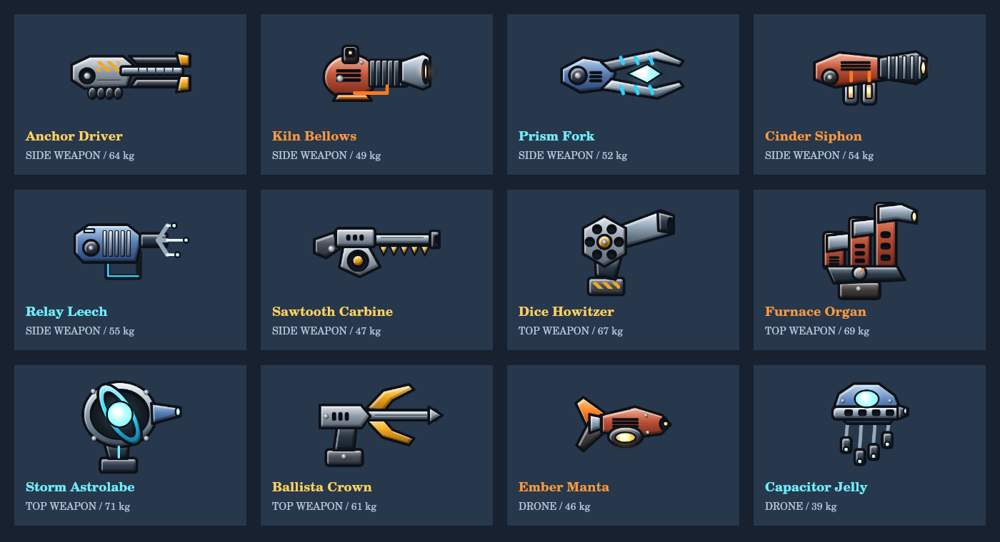
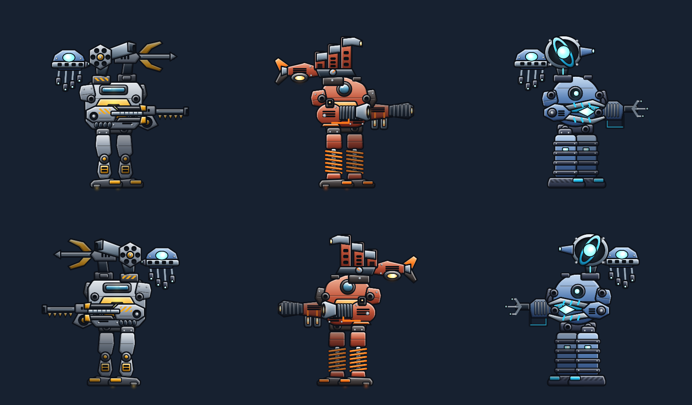

# Original Arsenal — Expansion III

Research checked September 30, 2026. Twelve original FreeMechs items: six side
weapons, four top weapons and two drones. Stats use this game's Divine-max
convention and existing tier scaling. These are new fan-game designs informed
by SuperMechs roles, not exact reproductions of its items or current balance.

## Research basis

- [Flaminator discussion](https://community.supermechs.com/topic/1290-should-flaminator-be-buffed/):
  players describe how energy costs make heat weapons vulnerable to energy
  builds, and how pairing weapons with different costs helps. They distinguish
  heat delivery from cooling damage. This informed the Bellows/Siphon pairing:
  repeatable energy-free heat pressure plus limited recovery damage.
- [Hybrid Energy Cannon weight discussion](https://community.supermechs.com/topic/1267-reduce-weight-on-hybrid-energy-cannon-to-50/):
  energy drain and heat pressure work differently; weapon weight competes with
  the modules a build needs. This informed the Fork/Leech/Astrolabe costs and
  weights. Community opinions are design context, not verified balance rules.
- [Frantic Flame discussion](https://community.supermechs.com/topic/3885-is-frantic-flame-worth/):
  contrasts limited, variable-damage weapons with consistent, repeatable ones;
  discusses Nemo, Swoop and Backstabbing Protector when weighing drone backfire.
  This informed the two-shot Dice Howitzer and the Manta's health cost.
- [Inventory management discussion](https://community.supermechs.com/topic/8369-inventory-management/page/2/):
  compares knockback, cooling damage and resource costs on close-range weapons.
  This informed the Anchor Driver's narrow firing range and displacement role.
- [Energy build advice](https://community.supermechs.com/topic/6520-an-update-on-my-mech/):
  compares Malice Beam and Hot Flash weight and recommends retaining space for
  heat and energy modules. This informed the lightweight Jelly companion and
  deliberate tradeoffs on specialist weapons.

All numeric values below are **FreeMechs tuning**, not copied SuperMechs stats.
The discussions are historical and opinions sometimes disagree; no claim of
current meta or live September 2026 stat parity is made.

## Item and art mapping

| Item (ID) | Role and constraints | Original geometry |
| --- | --- | --- |
| Anchor Driver (`s_anchordriver`) | Physical, Epic–Divine. Range 2–3, 215–305 damage, 9 armor drain, push 2, 3 uses. 64 weight, 44 heat, zero energy. Narrow-range knockback rather than an all-range damage upgrade. | Exposed hydraulic ram between split fork jaws; hanging chain magazine and hazard-painted pressure housing. |
| Kiln Bellows (`s_kilnbellows`) | Heat, Rare–Divine. Range 2–5, 130–205 damage and 96 heat, unlimited uses. 49 weight, 58 self heat. Sustained pressure with a low damage budget and substantial cooling demand. | Rounded pressure vessel, accordion bellows, flared ceramic nozzle and upright gauge. |
| Prism Fork (`s_prismfork`) | Energy, Rare–Divine. Range 2–5, 135–210 damage and 108 drain, unlimited uses. 52 weight, 58 energy, 12 heat. Repeatable drain requires strong regeneration. | Open tuning-fork arms enclosing a suspended diamond crystal, with electrode bands. |
| Cinder Siphon (`s_cindersiphon`) | Heat, Epic–Divine. Range 3–5, 105–170 damage, 65 heat, 28 cooling damage, 2 uses. 54 weight, 24 energy, 32 heat. Recovery breaker with limited ammunition and low direct damage. | Two separate coolant bottles and a perforated exchanger muzzle with visible feed pipes. |
| Relay Leech (`s_relayleech`) | Energy, Epic–Divine. Range 3–5, 105–175 damage, 72 drain, 28 regeneration damage, 2 uses. 55 weight, 48 energy, 18 heat. Needs a repeatable drain partner. | Transformer fins, a hanging cable loop and three offset needle antennas. |
| Sawtooth Carbine (`s_sawtooth`) | Physical, Common–Divine. Range 2–5, 155–245 damage, 5 armor drain, 4 uses. 47 weight, 28 heat, zero energy. Depot-accessible utility with finite ammunition. | Triangular drum and a toothed under-barrel rail on a long compact carbine. |
| Dice Howitzer (`tp_dicehowitzer`) | Physical, Epic–Divine. Range 4–7, 145–470 damage, 2 uses. 67 weight, 34 energy, 48 heat. Average 307.5 before resistance; large variance and no close-range answer. | Six-chamber polygonal revolver turret with a slanted cannon and elevated mount. |
| Furnace Organ (`tp_furnaceorgan`) | Heat, Epic–Divine. Range 4–7, 165–250 damage, 105 heat, 16 capacity damage, 3 uses. 69 weight, 64 heat, zero energy. Long-range capacity pressure at high weight and heat cost. | Three stepped furnace pipes with angled outlets, exhaust grilles and a dial. |
| Storm Astrolabe (`tp_stormastrolabe`) | Energy, Legendary–Divine. Range 4–7, 165–255 damage, 118 drain, 20 capacity damage, 3 uses. 71 weight, 64 energy, 14 heat. Capacity breaker with high power demand. | Intersecting gyroscopic rings around a floating electrode sphere and wedge emitter. |
| Ballista Crown (`tp_ballistacrown`) | Physical, Legendary–Divine. Range 5–8, 285–395 damage, 12 armor drain, 2 uses. 61 weight, 16 energy, 45 heat. Consistent sniper with a large dead zone. | Swept bow limbs, visible taut string and an arrowhead sabot rail. |
| Ember Manta (`d_embermanta`) | Heat, Epic–Divine. 115–185 damage, 48 heat each shot. 46 weight, 32 backfire, 35 heat, zero energy. Sustained automatic pressure spends HP. | Asymmetric manta wings, split exhaust tail and a glowing underslung furnace. |
| Capacitor Jelly (`d_capacitorjelly`) | Energy, Rare–Divine. 100–165 damage, 52 drain each shot. 39 weight, 38 energy, 8 heat. Lighter supporting drone with moderate damage. | Hover dome and four staggered capacitor tentacles, each with an emissive terminal. |

## Integration and artwork





`src/art/arsenal.ts` contains twelve separate Canvas drawing routines. No
existing weapon/drone maker is called and no existing silhouette is recolored
to make a new item. Shared plate, rivet, vent and lamp primitives preserve the
game's cel-shaded visual language. Each design has its own dimensions, mount
anchor and projectile muzzle; the normal sprite cache generates transparent
icons, near-side parts and darkened far-side parts from the same art.

The catalog drives loot pools, workshop selection, AI builder choices and
inventory rendering automatically. Sawtooth Carbine also appears in the
Common-grade Parts Depot. Existing item IDs and save formats are unchanged.
No battle-engine changes or new network protocol are required.

### Preview

Run `npm ci` and `npm run dev`, then open:

```text
/preview.html?ids=s_anchordriver,s_kilnbellows,s_prismfork,s_cindersiphon,s_relayleech,s_sawtooth,tp_dicehowitzer,tp_furnaceorgan,tp_stormastrolabe,tp_ballistacrown,d_embermanta,d_capacitorjelly
```

`ids` is an optional preview-only filter; existing type filtering still works.

### Validation

`tests/arsenal.test.ts` covers loot access, legal equipment and finite stats
through every supported tier, dedicated art routing, mounts/muzzles, both
firing-range endpoints and close-range rejection, costs, armor break, push,
recovery damage, capacity damage, exhaustion and automatic drone costs.
Existing catalog sidegrade checks also run against the expanded catalog.
These establish functional compatibility, not exhaustive competitive balance;
real-player matchup feedback may justify later tuning.

All twelve sprites were also rasterized using a native Canvas implementation
and inspected visually. The raster outputs are nonempty and distinct; three
assembled mech loadouts were inspected facing both directions. The previews
above are produced by the actual game drawing routines, not concept artwork.
Browser automation could not run in the local execution environment, so this
is Canvas-level visual verification rather than a browser interaction test.
